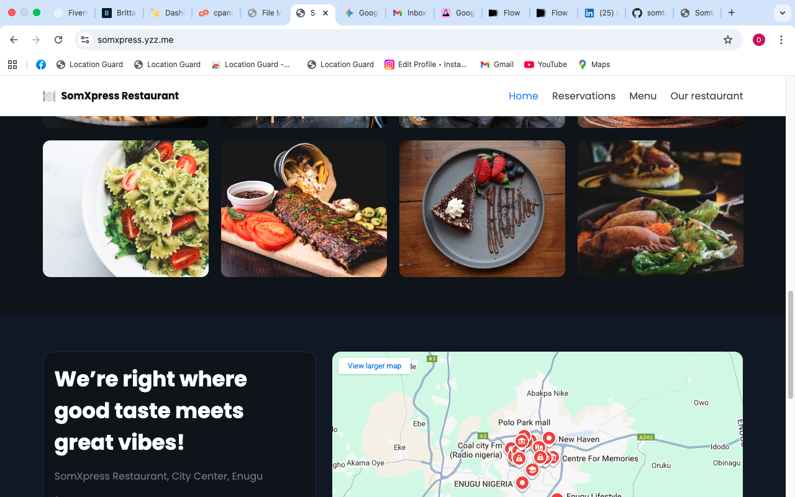

# 💻 Somtochukwu Uzochukwu – Full-Stack / Frontend Developer

Welcome to my personal developer portfolio!  
This website showcases my work as a **Frontend and Full-Stack Developer**, highlighting my freelance projects, technical skills, and the creative problem-solving behind **SomXpress DevXpress**.

---

## 🌍 Live Demo
🔗 [View Portfolio](https://yourusername.github.io/)  
*(Replace this link with your actual GitHub Pages URL once deployed.)*

---

## 🧠 About Me
I’m a developer passionate about building **functional, user-focused, and visually engaging digital experiences**.  
My journey began with coding and design, and evolved into delivering complete end-to-end solutions for clients worldwide.  

Through my freelance brand **SomXpress DevXpress**, I design and build websites that combine **modern front-end aesthetics** with **solid back-end performance** — helping businesses bring their ideas online.

---

## ⚙️ What I Do
- 💻 **Frontend Development** – HTML5, CSS3, JavaScript (ES6+), and React for dynamic, responsive UIs.  
- 🧱 **Full-Stack Solutions** – PHP, MySQL, and API integrations for scalable web apps.  
- 🧩 **WordPress / Elementor** – Custom, responsive sites for small businesses, restaurants, and e-commerce brands.  
- 🛠️ **Website Optimization** – Page speed, SEO readiness, and mobile-friendly layouts.  
- 🎨 **UI/UX Design** – Clean, modern visuals with attention to user flow and accessibility.  

---

## 🚀 Freelance Experience
I’ve successfully delivered projects on **Upwork** and **Fiverr**, collaborating with clients across multiple industries — including:
- Restaurants & Cafés  
- FinTech startups (e.g., **RainMoney.ng**)  
- Tech & repair businesses  
- Personal brand and portfolio websites  

My clients appreciate my focus on clear communication, detail-oriented development, and quick project delivery.

---

## 🧰 Technologies & Tools
| Front-End | Back-End | CMS / Builder | Version Control | Design |
|------------|-----------|----------------|------------------|--------|
| HTML5, CSS3, JS (ES6+), React | PHP, MySQL, REST APIs | WordPress, Elementor, WooCommerce | Git, GitHub | Figma, Canva, Adobe XD |

---

## 📁 Project Structure

